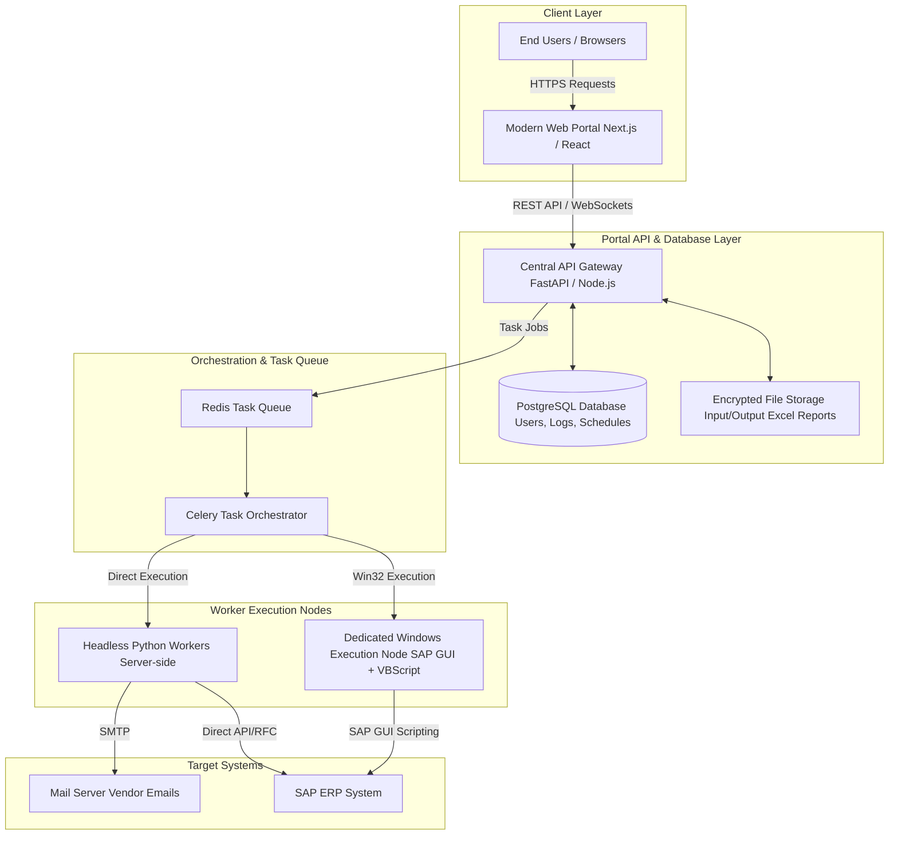
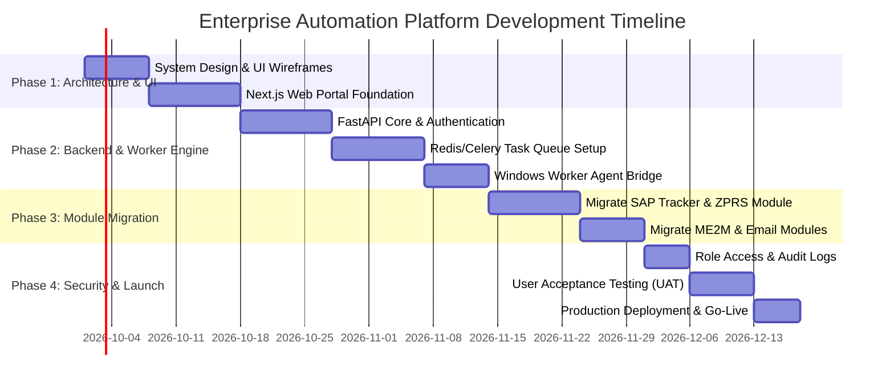

# Enterprise Automation Platform: Architecture Blueprint & Implementation Plan

## Executive Summary & Feasibility

**Yes, this is 100% achievable and is standard enterprise best practice.**

Transforming standalone desktop scripts (Python, VBScript, Batch files) into a centralized **Enterprise Web Automation Hub** provides major organizational advantages:

1. **Intellectual Property & Code Security**: Source code remains entirely on secure servers. Users never see, copy, or download VBScripts or Python files.
2. **Zero-Client Installation**: End users do not need Python, SAP scripting configurations, LibreOffice/Excel setups, or local dependencies. They simply log into a web dashboard in their browser.
3. **Unified Multi-Project Portal**: SAP Daily Tracker, ZPRS Pending Updates, SAP ME2M Procurement Analyzer, and Bulk Vendor Emailing will exist as separate, permissioned tools under a single organization website.
4. **Auditability & Centralized Monitoring**: Every automation run is logged with timestamps, input parameters, generated Excel reports, and execution status.

---

## Technical Architecture Overview

---

## Core Components Breakdown

### 1. Frontend Web Portal (User Interface)
* **Technology**: Next.js / React + Tailwind CSS / Modern Dark-Light UI.
* **Features**:
  * **Role-Based Access Dashboard**: Admins, Managers, and Operations Users see only the tools they are permitted to use.
  * **Interactive Task Launcher**: Upload input files, set parameters, and click "Run Automation".
  * **Live Progress Streaming**: Real-time console logs and visual progress bars via WebSockets.
  * **Report Center**: Download structured output Excel workbooks directly from the web dashboard.
  * **Scheduled Automations**: Built-in cron/scheduler UI (e.g., "Run SAP Tracker every morning at 8:00 AM").

### 2. Central API Gateway & Security Core
* **Technology**: Python FastAPI or Node.js Express.
* **Features**:
  * **Authentication & SSO**: SAML/OAuth2 or JWT login linked with corporate Active Directory / Single Sign-On.
  * **Secret Management**: SAP passwords and server credentials stored in encrypted vaults (e.g., HashiCorp Vault or AWS Secrets Manager), keeping credentials hidden from end users.
  * **RBAC (Role-Based Access Control)**: Restrict automation execution and report viewing based on department roles.

### 3. Asynchronous Job Execution Engine
* **Technology**: Redis + Celery / BullMQ.
* **Why Async?**: Automations (like reading SAP grids or sending 100+ emails) can take several minutes. Web browsers would time out on normal requests. An async task queue accepts the job, runs it in the background, and updates the user in real time.

### 4. Hybrid Automation Workers (Handling SAP GUI & VBScript)
* **Headless Python Modules**: Tasks like Excel consolidation, report analysis, email dispatching run directly inside high-speed Linux/Docker containers on the server.
* **Windows GUI Execution Worker (For SAP VBScript)**:
  * Since SAP GUI VBScript requires a Windows environment with active SAP GUI installed, standard backend servers cannot execute GUI interactions natively.
  * **Solution**: A dedicated on-premise Windows Server / VM acts as an automated "Worker Agent". The Celery orchestrator sends the job to this VM, which launches the VBScript/SAP GUI in a controlled environment, extracts the data, and posts results back to the database.

---

## Unified Multi-Project Catalog Strategy

The platform will host a modular **"Automation Storefront"** inside your organization:

| Module Name | Purpose | Execution Type | Key Input/Output |
| :--- | :--- | :--- | :--- |
| **SAP Daily Tracker** | Batch updates for POs, Releases, and Tracker Statuses | Windows Execution Worker (VBS + Python) | Upload Excel / Auto-sync with SAP -> Consolidated Report Download |
| **ZPRS Pending Tracker** | Track ZPRS Pending items and priority status | Windows Execution Worker (VBS + Python) | Filter by plant/dept -> Push to SAP -> Summary Dashboard |
| **SAP ME2M Procurement Analyzer** | 90-day horizon procurement & schedule analysis | Server-side Python Engine | Raw SAP CSV -> Analyzed Action Report |
| **Bulk Vendor Email Dispatcher** | Automates Zimbra/SMTP email follow-ups to 100+ vendors | Server-side Python Engine | Recipient Excel + Template -> Real-time Delivery Log |
| **Custom New Project Plug-in** | Flexible runner template for any new Python/VBS script | Modular API Handler | Custom Inputs -> Execution -> Output |

---

## Source Code & Intellectual Property Protection

To ensure **no employee can copy or steal** the core automation logic:

1. **Zero Client Footprint**: Code is strictly stored on private server repositories. Users only interact with web buttons and APIs.
2. **Compiled Python Engines**: Production code can be compiled into bytecode (`.pyc`) or standalone binaries using `Cython` or `PyArmor` on the server host.
3. **Environment Decoupling**: Database connections, SAP connection strings, and encryption keys are injected via secure Environment Variables (`.env`) accessible only by the server administrator.

---

## Phased Step-by-Step Implementation Roadmap

### Phase 1: Platform Foundation & Core Web UI (Weeks 1 - 2)
* Setup Next.js Web Application framework with modern dark UI.
* Build user authentication system (Login, User Management, Dashboard layout).
* Design the "Automation Project Marketplace" UI layout.

### Phase 2: API Gateway & Execution Worker Queue (Weeks 3 - 4)
* Build FastAPI backend for managing automation triggers and standardizing file uploads/downloads.
* Integrate Redis + Celery task queue for handling asynchronous background executions.
* Configure the dedicated Windows Execution Agent for SAP GUI VBScripts.

### Phase 3: Module Migration & Integration (Weeks 5 - 6)
* Refactor existing Python scripts (`engine.py`, ME2M analyzers, email engines) into backend API workers.
* Wrap VBScript controllers into standard API payloads.
* Implement real-time output logging (viewing terminal logs on the web browser).

### Phase 4: IP Security, Audit Trails & Deployment (Weeks 7 - 8)
* Add comprehensive Audit Logging (Who ran what, when, with what input file).
* Secure all environment configurations and compile Python modules.
* Deploy to internal company servers (IIS/Nginx + Docker/Windows Service host) for internal network access.

---

## Summary of Next Steps for Future Development

When you are ready to begin developing this project:
1. **Infrastructure Preparation**: Reserve an internal server (or Windows VM with SAP GUI access).
2. **Project Workspace**: Initialize a fresh repository (e.g., `Enterprise-Automation-Hub`) separate from desktop script workspaces.
3. **API & UI Development**: Start by building the Web Portal and connecting the existing scripts step-by-step as backend worker modules.
